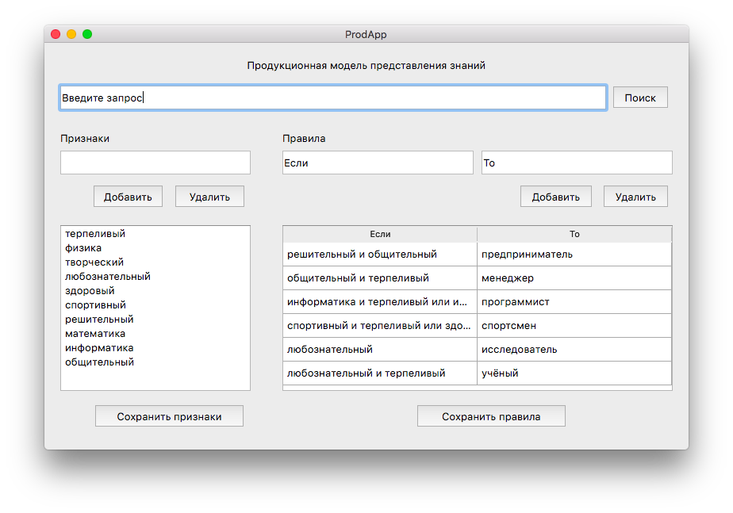
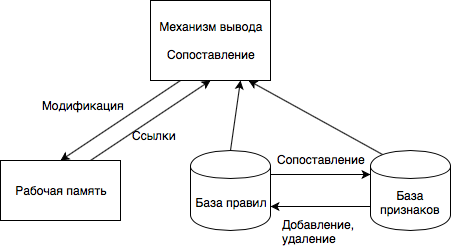

# prod-model
Продукционная модель на Python

***

<h2> Запуск: </h2>
Рекомендуется использовать Python 3

```
git clone https://github.com/vadrx/frame-model
cd frame-model
python3 main.py
```

***
<h2> Схема конфигурации системы продукций:</h2>




